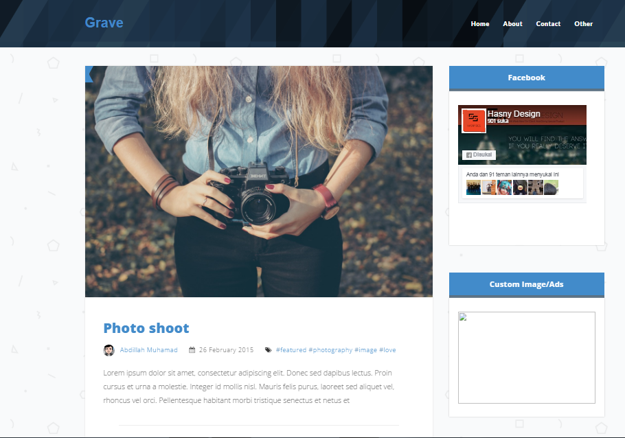
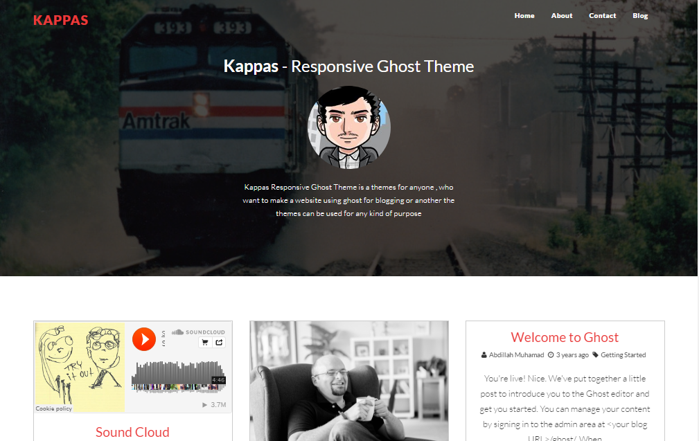
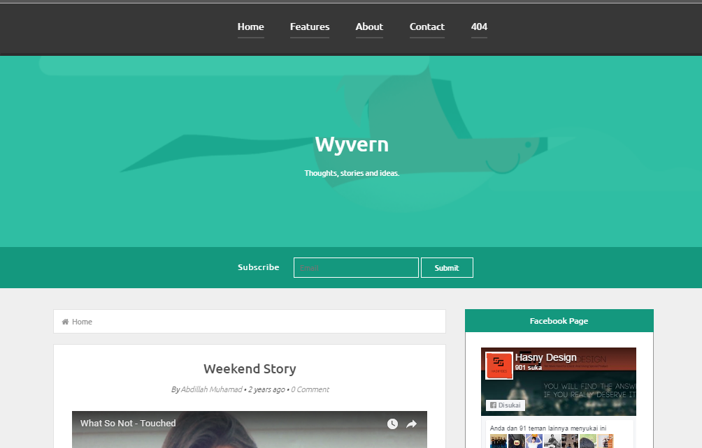
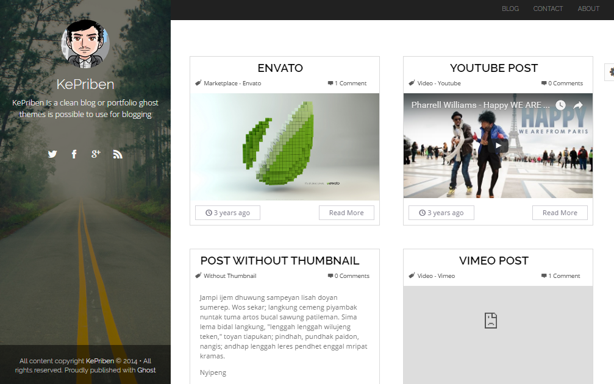

### My Ghost CMS Themes

- [Grave](http://gravedemo-hasnydesign.rhcloud.com)
- [Kappas](http://kappas-responsivethemes.rhcloud.com)
- [Wyvern](http://wyvern-hasnydes.rhcloud.com)
- [Kepriben](http://kepriben-responsivethemes.rhcloud.com)

### How to use

Copy folder theme you want to use to `<ghostcmsdirectory>/content/themes/`

ex use grave theme : `mv grave /var/www/ghost0.6.x/content/themes/`

### Screenshot

### License

MIT @abdilahrf
